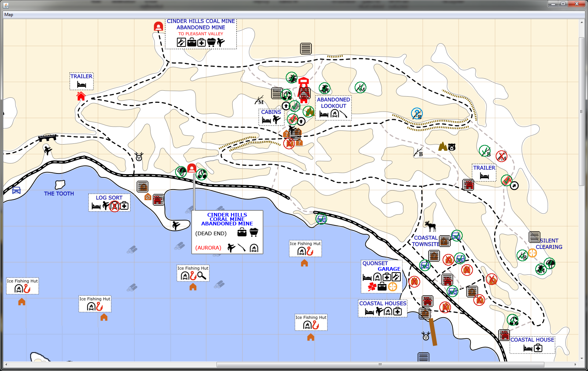

# The-Long-Dark-Helpers
Helper programs for playing The Long Dark

# Map Helper

## How does it work?

To create a new map, you have to load an image. You can grab an image of the map from the Internet, take a screenshot of what you mapped in game or you could even draw it yourself.

Right click anywhere to place a new marker.

Left or right click an existing marker to interact with it.

## Installation

Simply download and run jar file. You need to have [Java](https://www.java.com/en/download/) installed.

## Releases

You can download jar files from this [Google drive folder](https://drive.google.com/open?id=1a-Tr_NBwtsMtFzHucmmitY7k2Cus0NJt).

See all the updates in the [changelog](CHANGELOG.md).

## Build the source code yourself

Build jar file by running `mvn clean compile assembly:single`.
